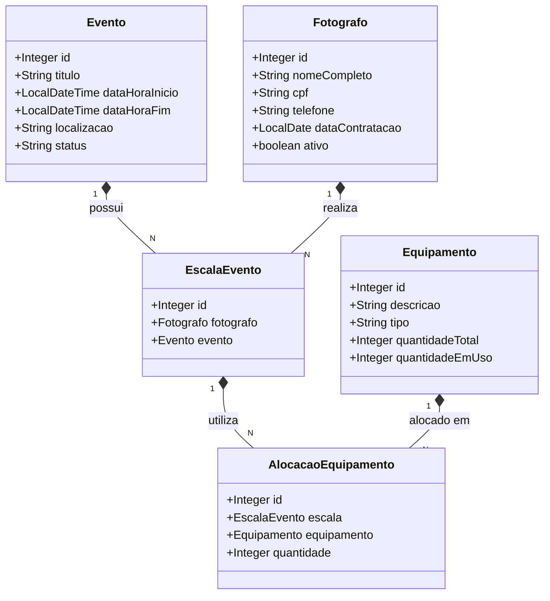
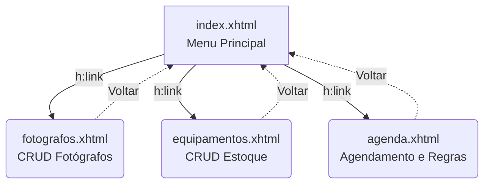

# Sistema de Gestão de Agenda Fotográfica e Estoque


Projeto acadêmico desenvolvido para a disciplina de Programação Web do curso de **Sistemas de Informação da Universidade Estadual de Goiás (UEG)**. 

Trata-se de um sistema web completo para gerenciar a escala de fotógrafos em eventos e controlar o inventário de equipamentos do estúdio, aplicando conceitos rigorosos de engenharia de software, como Arquitetura em Camadas (MVC), transações ACID no banco de dados e Design Patterns (DAOs, Controllers, Converters).

---

## Principais Funcionalidades e Regras de Negócio

- **CRUD de Fotógrafos:** Cadastro completo de profissionais com validação de chaves.
- **Controle de Estoque (Inventário):** Gestão de câmeras, lentes e acessórios.
- **Agendamento Inteligente (Regra de Negócio 1 - Concorrência):** O sistema impede matematicamente que o mesmo fotógrafo seja escalado para dois eventos que tenham sobreposição de horário.
- **Alocação de Equipamentos (Regra de Negócio 2 - Integridade):** O sistema impede a retirada de equipamentos caso a quantidade solicitada seja maior que o estoque livre disponível.
- **Exclusão em Cascata e Rollback Manual:** O cancelamento de um evento devolve automaticamente os itens ao estoque e libera a agenda do profissional envolvido, garantindo a atomicidade (ACID).

---

## Diagrama de Classes (Modelo de Domínio)

O diagrama abaixo representa a estrutura orientada a objetos do sistema e como as tabelas intermediárias resolvem a cardinalidade N:N.



---

## Fluxo de Navegação (Views)

A interface foi desenvolvida em XHTML/JSF com navegação implícita focada na simplicidade e eficiência.



---

## Configuração do Banco de Dados (PostgreSQL)

Para rodar o projeto localmente, crie um banco de dados chamado `agendafotografos` no PostgreSQL e execute o script DDL abaixo para estruturar as tabelas:

```sql
-- 1. Tabela Fotógrafo
CREATE TABLE fotografo (
    id SERIAL PRIMARY KEY,
    nome_completo VARCHAR(100) NOT NULL,
    cpf VARCHAR(14) UNIQUE NOT NULL,
    telefone VARCHAR(20),
    data_contratacao DATE NOT NULL,
    ativo BOOLEAN DEFAULT TRUE
);

-- 2. Tabela Equipamento (Estoque)
CREATE TABLE equipamento (
    id SERIAL PRIMARY KEY,
    descricao VARCHAR(100) NOT NULL,
    tipo VARCHAR(50) NOT NULL,
    quantidade_total INTEGER NOT NULL CHECK (quantidade_total > 0),
    quantidade_em_uso INTEGER DEFAULT 0 CHECK (quantidade_em_uso >= 0)
);

-- 3. Tabela Evento Base
CREATE TABLE evento (
    id SERIAL PRIMARY KEY,
    titulo VARCHAR(150) NOT NULL,
    data_hora_inicio TIMESTAMP NOT NULL,
    data_hora_fim TIMESTAMP NOT NULL,
    localizacao VARCHAR(200),
    status VARCHAR(50) DEFAULT 'Agendado'
);

-- 4. Tabela Intermediária: Escala do Fotógrafo no Evento
CREATE TABLE escala_evento (
    id SERIAL PRIMARY KEY,
    id_fotografo INTEGER NOT NULL REFERENCES fotografo(id) ON DELETE RESTRICT,
    id_evento INTEGER NOT NULL REFERENCES evento(id) ON DELETE CASCADE
);

-- 5. Tabela Intermediária: Equipamentos levados na Escala
CREATE TABLE alocacao_equipamento (
    id SERIAL PRIMARY KEY,
    id_escala INTEGER NOT NULL REFERENCES escala_evento(id) ON DELETE CASCADE,
    id_equipamento INTEGER NOT NULL REFERENCES equipamento(id) ON DELETE RESTRICT,
    quantidade INTEGER NOT NULL CHECK (quantidade > 0)
);
```

---

## Guia de Instalação e Execução

### Pré-requisitos
* **JDK 8** (Java SE 8)
* **IDE:** NetBeans (Versão 8.2 ou superior recomendada)
* **Servidor de Aplicação:** GlassFish Server (4.1+)
* **Banco de Dados:** PostgreSQL (9.0+)
* **Driver JDBC:** Driver do PostgreSQL adicionado na pasta `lib` ou bibliotecas do projeto.

### Passos para rodar:
1. Clone este repositório:
   ```bash
   git clone [https://github.com/SEU_USUARIO/AgendaFotografosWeb.git](https://github.com/SEU_USUARIO/AgendaFotografosWeb.git)
   ```
2. Abra o projeto no **NetBeans**.
3. No pacote `util`, localize a classe `ConexaoBD.java` e altere as credenciais (`USER` e `PASSWORD`) para as do seu banco de dados local.
4. Execute o script SQL fornecido acima no seu *pgAdmin* ou *DBeaver*.
5. Clique com o botão direito no projeto no NetBeans e selecione **Executar (Run)**.
6. O NetBeans fará o *deploy* no GlassFish e abrirá o navegador no endereço: `http://localhost:8080/AgendaFotografosWeb/`

---

## Autor

**Manoel** *Estudante de Sistemas de Informação - UEG (Universidade Estadual de Goiás)* Projeto desenvolvido como requisito prático para avaliação acadêmica.
